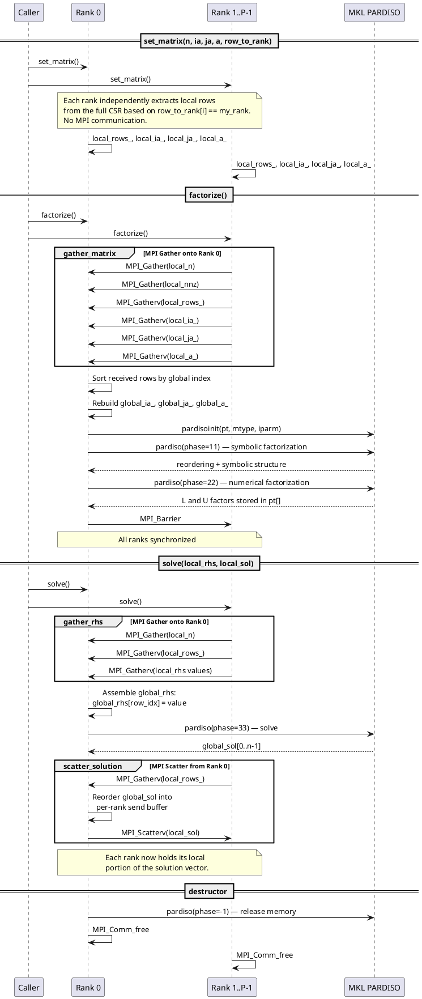
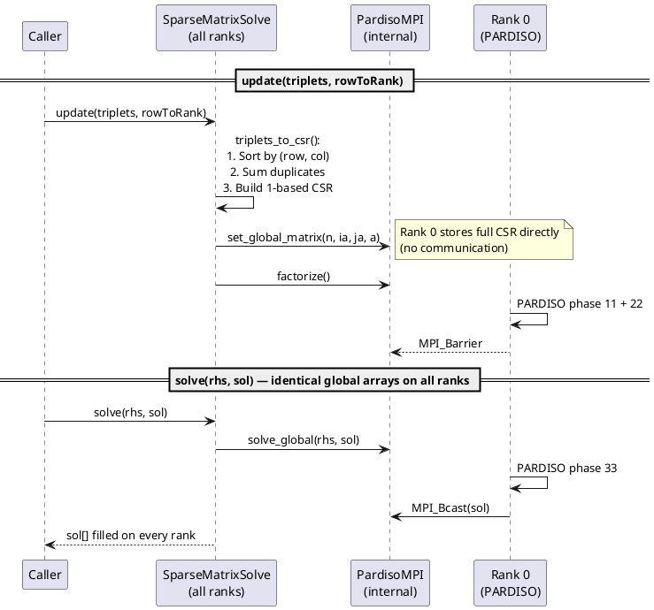

# Developer Guide: How the Solver Works over MPI

This document describes the internal data flow of the two solver classes and
how work is distributed across MPI ranks.

## Architecture Overview

There are two layers:

```
SparseMatrixSolvePardiso          (high-level: triplets in, global solution out)
        |
        v
    PardisoMPI                    (low-level: 1-based CSR in, local solution out)
        |
        v
    MKL PARDISO                   (serial direct solver, runs only on rank 0)
```

PARDISO itself is **not** an MPI-parallel solver.  The MPI layer in this
project handles distributing the input and collecting the output.  All actual
factorization and solve work happens on rank 0.

## Row Ownership Model

The caller provides a `row_to_rank` array of size `n` (the global matrix
dimension).  Entry `row_to_rank[i]` is the MPI rank that "owns" global row `i`.
The mapping can be arbitrary -- rows need not be contiguous or ordered per rank.

Example with `n = 16` and 4 MPI ranks (even block distribution):

```
row_to_rank = [0,0,0,0, 1,1,1,1, 2,2,2,2, 3,3,3,3]
                rank 0     rank 1     rank 2     rank 3
```

But non-contiguous mappings like `[0,1,2,3, 0,1,2,3, ...]` also work.

## Data Flow: `PardisoMPI`

### `set_matrix(n, ia, ja, a, row_to_rank)`

Every rank receives the **full** global CSR arrays (`ia`, `ja`, `a`) with
1-based indexing.  Each rank then **extracts only its local rows**:

```
All ranks (independently, no communication):

for i = 0..n-1:
    if row_to_rank[i] == my_rank:
        append i to local_rows_
        copy ia/ja/a entries for row i into local_ia_/local_ja_/local_a_
```

The local CSR is re-based so `local_ia_[0] = 1`.  Column indices are kept
in global 1-based numbering (columns are not partitioned).

After this call, each rank holds:

| Rank   | Data stored                                                    |
|--------|----------------------------------------------------------------|
| rank r | `local_rows_` (sorted global row indices where row_to_rank = r)|
|        | `local_ia_` (1-based row pointers, size local_n + 1)          |
|        | `local_ja_` (1-based global column indices)                    |
|        | `local_a_`  (corresponding values)                             |

### `factorize()`  --  `gather_matrix` then PARDISO phases 11 + 22

#### Step 1: Gather counts (all ranks -> rank 0)

```
MPI_Gather:  local_n    ->  all_local_n[comm_size]    (on rank 0)
MPI_Gather:  local_nnz  ->  all_local_nnz[comm_size]  (on rank 0)
```

#### Step 2: Gather CSR pieces (all ranks -> rank 0)

Four `MPI_Gatherv` calls collect the distributed CSR onto rank 0:

```
MPI_Gatherv:  local_rows_  ->  recv_rows    (which global rows each rank sent)
MPI_Gatherv:  local_ia_    ->  recv_ia      (local row pointers from each rank)
MPI_Gatherv:  local_ja_    ->  recv_ja      (column indices)
MPI_Gatherv:  local_a_     ->  recv_a       (values)
```

#### Step 3: Rebuild global CSR (rank 0 only)

The received rows arrive grouped by rank, not sorted by global row index.
Rank 0 builds a `RowInfo` struct for each received row recording its global
index, offset into `recv_ja`/`recv_a`, and number of non-zeros.  These are
**sorted by global row index**, then copied into contiguous `global_ia_`,
`global_ja_`, `global_a_` arrays forming a valid 1-based CSR matrix.

```
rank 0:

for each rank r:
    for each local row li of rank r:
        record {global_row, ja_offset, nnz}

sort by global_row

for i = 0..n-1:
    global_ia_[i] = running pointer
    memcpy ja and a entries for row i
```

#### Step 4: PARDISO factorization (rank 0 only)

Rank 0 calls `pardisoinit` then:
- **Phase 11** (symbolic factorization) on `global_ia_`, `global_ja_`, `global_a_`
- **Phase 22** (numerical factorization) on the same arrays

All other ranks wait at an `MPI_Barrier`.

### `solve(rhs, solution)`  --  gather RHS, PARDISO phase 33, scatter solution

#### Step 1: Gather RHS (all ranks -> rank 0)

Each rank passes a local RHS array of size `local_n` (entries for its owned
rows, in the same order as `local_rows_`).

```
MPI_Gather:    local_n          -> counts[comm_size]     (on rank 0)
MPI_Gatherv:   local_rows_      -> recv_rows_flat        (row indices)
MPI_Gatherv:   local_rhs        -> recv_vals             (RHS values)
```

Rank 0 scatters the received values into a global RHS vector of size `n`,
using the row indices to place each value at the correct position:

```
rank 0:
    global_rhs[recv_rows_flat[k]] = recv_vals[k]    for all k
```

#### Step 2: PARDISO solve (rank 0 only)

Rank 0 calls PARDISO **phase 33** (forward/backward substitution) with the
full global CSR and the assembled global RHS.  The result is a global solution
vector of size `n`.

#### Step 3: Scatter solution (rank 0 -> all ranks)

Rank 0 needs to send each rank its portion of the solution, but the solution
is in global row order while each rank expects values in `local_rows_` order.

```
MPI_Gatherv:  local_rows_  ->  recv_rows_flat   (rank 0 learns each rank's row ordering)

rank 0:
    send_buf[k] = global_sol[recv_rows_flat[k]]  for all k

MPI_Scatterv:  send_buf  ->  local_sol  (each rank gets its local_n values)
```

### `pardiso_cleanup()`  --  phase -1 (rank 0 only)

Rank 0 calls PARDISO phase -1 to release internal memory.  All ranks clear
their gathered data buffers and zero the PARDISO handle array.

## Data Flow: `SparseMatrixSolvePardiso`

This is a higher-level wrapper that sits on top of `PardisoMPI`.  It accepts
COO triplets instead of pre-built CSR, and its `solve()` returns the **full
global** solution on every rank.

Every rank must supply the **same** complete set of triplets and the **same**
global RHS vector.  Because the full data is already available on every rank,
no per-rank distribution or gather/scatter is needed — rank 0 uses the data
directly and broadcasts the result.

### `update(triplets, rowToRank)`

```
1. triplets_to_csr(triplets):
     - Sort all triplets by (row, col)
     - Merge duplicates: entries with same (row,col) have values summed
     - Build 1-based CSR arrays ia_, ja_, a_
2. pardiso_.set_global_matrix(n, ia, ja, a)   // rank 0 stores full CSR
3. pardiso_.factorize()                       // rank 0 factorizes (no gather)
```

The `rowToRank` parameter is retained for API compatibility but is unused.

### `solve(rhs, sol)`

The caller passes **global** arrays of size `n` (identical on every rank).

```
1. pardiso_.solve_global(rhs, sol)
     - Rank 0 calls PARDISO phase 33 with the full RHS
     - MPI_Bcast sends the full solution to all ranks
```

## Communication Summary

| Operation                  | MPI Calls                                    | Direction         |
|----------------------------|----------------------------------------------|-------------------|
| `set_matrix`               | None (local extraction only)                 | --                |
| `set_global_matrix`        | None (rank 0 stores full CSR)                | --                |
| `factorize` / `gather_matrix` | 2x `MPI_Gather` + 4x `MPI_Gatherv` + `MPI_Barrier` | all -> rank 0  |
| `factorize` (global mode)  | `MPI_Barrier` only                           | --                |
| `solve` / `gather_rhs`    | 1x `MPI_Gather` + 2x `MPI_Gatherv`          | all -> rank 0     |
| `solve` / PARDISO phase 33| None (rank 0 only)                           | --                |
| `solve` / `scatter_solution`| 1x `MPI_Gather` + 1x `MPI_Gatherv` + 1x `MPI_Scatterv` | rank 0 -> all |
| `solve_global`             | 1x `MPI_Bcast`                               | rank 0 -> all     |

## Sequence Diagrams (PlantUML)

### `PardisoMPI`: Factorize and Solve



### `SparseMatrixSolvePardiso`: Update and Solve



### Data Ownership Across Ranks

```plantuml
@startuml data_ownership
skinparam packageStyle rectangle

package "Rank 0" {
  [local_rows_ = {0,1,2,3}]  as L0
  [local CSR: rows 0-3]       as CSR0
  [global CSR: rows 0-15]     as GCSR  #LightGreen
  [PARDISO factors (pt[])]    as FACT  #LightGreen
  note right of GCSR : Only on rank 0\nafter gather_matrix()
}

package "Rank 1" {
  [local_rows_ = {4,5,6,7}]  as L1
  [local CSR: rows 4-7]       as CSR1
}

package "Rank 2" {
  [local_rows_ = {8,9,10,11}] as L2
  [local CSR: rows 8-11]       as CSR2
}

package "Rank 3" {
  [local_rows_ = {12,13,14,15}] as L3
  [local CSR: rows 12-15]        as CSR3
}

CSR0 -[hidden]-> GCSR
CSR1 -[hidden]-> L1
CSR2 -[hidden]-> L2
CSR3 -[hidden]-> L3

note bottom of "Rank 0"
  Rank 0 holds both its local slice
  AND the gathered global matrix
  plus PARDISO's internal state.
end note

note bottom of "Rank 3"
  Non-root ranks only hold
  their local CSR slice and
  local portions of RHS/solution.
end note

@enduml
```

## Limitations and Design Choices

- **Rank 0 bottleneck**: All factorization and solve work happens on rank 0.
  This is a deliberate simplification -- it is not a distributed solver.  The
  MPI layer provides a convenient interface for codes that already have
  row-distributed data.

- **Memory**: Rank 0 holds the full global CSR plus PARDISO's internal
  factorization data.  Other ranks only hold their local CSR slices.

- **Repeated gathers**: `scatter_solution` re-gathers `local_rows_` from all
  ranks instead of caching it from `gather_matrix`.  This keeps the code
  simpler at the cost of a small extra communication of integer indices.

- **1-based indexing**: PARDISO requires 1-based CSR.  All internal storage
  uses 1-based indexing.  `SparseMatrixSolvePardiso` accepts 0-based triplets
  and converts internally.
