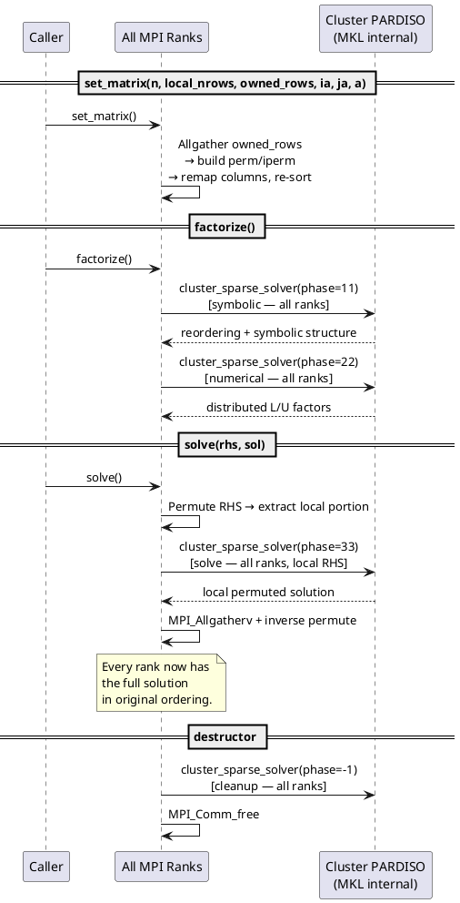
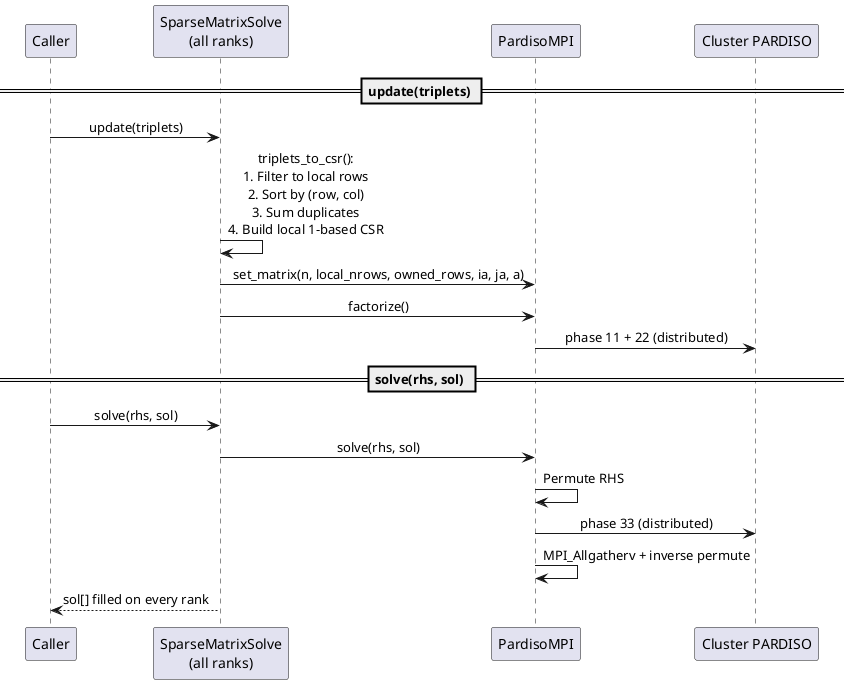

# Developer Guide: How the Solver Works over MPI

This document describes the internal data flow of the two solver classes and
how work is distributed across MPI ranks.

## Architecture Overview

There are two layers:

```
SparseMatrixSolvePardiso          (high-level: triplets in, global solution out)
        |
        v
    PardisoMPI                    (low-level: 1-based CSR in, global solution out)
        |
        v
    MKL Cluster PARDISO           (MPI-parallel direct solver)
```

**Cluster PARDISO** is a truly distributed solver — factorization and solve
work is split across all MPI ranks internally by MKL.  The wrapper classes
handle format conversion and provide a convenient C++ interface.

## Input Model

Both `PardisoMPI` and `SparseMatrixSolvePardiso` use **distributed assembled
input** (`iparm[39] = 2`):

- Every rank calls each method (all operations are **collective**).
- Each rank provides only the matrix rows it owns via `set_matrix()`.
  The owned rows need **not** be contiguous — the wrapper builds a
  symmetric permutation that maps each rank's rows to a contiguous
  block, remaps column indices, and inverse-permutes the solution.
- `iparm[40]` and `iparm[41]` tell Cluster PARDISO each rank's
  (contiguous, permuted) row range.
- Every rank must supply the full global RHS to `solve()`.  The wrapper
  permutes the RHS internally before extracting the local portion.
- After a solve, the permuted solution is assembled via
  `MPI_Allgatherv`, then inverse-permuted back to the original
  ordering on every rank.

## Data Flow: `PardisoMPI`

### `set_matrix(n, local_nrows, owned_rows, ia, ja, a)`

Collective.  Each rank provides its owned rows (which may be
non-contiguous) and the corresponding local CSR data.

```
1. MPI_Allgather + MPI_Allgatherv to collect owned_rows from all ranks.
2. Build permutation perm_/iperm_:
     perm_[new_idx]  = old_idx   (0-based)
     iperm_[old_idx] = new_idx   (0-based)
   Rank 0's rows become permuted rows [0, n0), rank 1 gets [n0, n0+n1), etc.
3. Copy local CSR and remap column indices:
     new_col = iperm_[old_col - 1] + 1
   Then re-sort columns within each row (PARDISO requires sorted columns).
4. Compute contiguous first_row_/last_row_ from gather_displs_.
```

### `factorize()`  — Cluster PARDISO phases 11 + 22

Collective.  All ranks participate in the distributed factorization.

```
All ranks call:
    cluster_sparse_solver(phase=11)   — symbolic factorization
    cluster_sparse_solver(phase=22)   — numerical factorization

Each rank passes its local_ia_, local_ja_, local_a_.
iparm[39]=2, iparm[40]=first_row, iparm[41]=last_row.
```

Internally, Cluster PARDISO distributes the work (reordering, LU factors)
across all ranks using MPI.

### `solve(rhs, sol)`  — Cluster PARDISO phase 33 + inverse permute

Collective.  All ranks participate in the distributed solve.

```
1. Permute full RHS:  perm_rhs[new_i] = rhs[perm_[new_i]]
2. Each rank extracts its local portion of perm_rhs and calls:
     cluster_sparse_solver(phase=33)   — forward/backward substitution
3. MPI_Allgatherv assembles the full permuted solution.
4. Inverse-permute:  sol[perm_[i]] = perm_sol[i]

Every rank now has the full solution in the original ordering.
```

### `pardiso_cleanup()`  — phase -1

Collective.  All ranks call `cluster_sparse_solver(phase=-1)` to release
internal memory.  This is called automatically in the destructor.

## Data Flow: `SparseMatrixSolvePardiso`

This is a higher-level wrapper that sits on top of `PardisoMPI`.  It accepts
COO triplets instead of pre-built CSR.

Every rank must supply the **same** complete set of triplets and the **same**
global RHS vector.

### `update(triplets)`

```
1. triplets_to_csr(triplets):
     - Filter triplets to this rank's rows (block partition)
     - Sort by (local_row, col)
     - Merge duplicates: entries with same (row,col) have values summed
     - Build local 1-based CSR arrays ia_, ja_, a_
2. Build owned_rows array for this rank's block partition
3. pardiso_.set_matrix(n, local_nrows, owned_rows, ia, ja, a)
     — builds permutation, remaps columns
4. pardiso_.factorize()  — distributed factorization
```

### `solve(rhs, sol)`

```
1. pardiso_.solve(rhs, sol)
     - Permute RHS, Cluster PARDISO phase 33, inverse-permute solution
     - MPI_Allgatherv assembles the full solution on all ranks
```

## Communication Summary

| Operation          | MPI Calls                                         | Direction     |
|--------------------|---------------------------------------------------|---------------|
| `set_matrix`       | `MPI_Allgather` + `MPI_Allgatherv` (permutation)  | all → all     |
| `factorize`        | Internal to Cluster PARDISO (phases 11 + 22)      | all ↔ all     |
| `solve`            | Internal to Cluster PARDISO (phase 33) + `MPI_Allgatherv` | all ↔ all  |
| `pardiso_cleanup`  | Internal to Cluster PARDISO (phase -1)            | all ↔ all     |

All operations are **collective** — every rank in the communicator must
participate.  The internal MPI communication is managed entirely by
Cluster PARDISO; the explicit MPI calls in the wrapper are
`MPI_Allgather` + `MPI_Allgatherv` in `set_matrix` (to build the
permutation) and `MPI_Allgatherv` after the solve (to assemble and
inverse-permute the solution).

## Sequence Diagram (PlantUML)

### `PardisoMPI`: Full Lifecycle



### `SparseMatrixSolvePardiso`: Update and Solve



## Key Parameters

| iparm index | Value | Meaning |
|-------------|-------|---------|
| `iparm[0]`  | 1     | Use custom parameter values |
| `iparm[1]`  | 2     | Nested dissection reordering (METIS) |
| `iparm[34]` | 0     | 1-based indexing |
| `iparm[39]` | 2     | Distributed assembled matrix input |
| `iparm[40]` | varies | First row owned by this rank (1-based) |
| `iparm[41]` | varies | Last row owned by this rank (1-based) |

## Linking

Cluster PARDISO requires BLACS in addition to the standard MKL libraries:

- **`mkl_rt` (single dynamic library)**: Includes Cluster PARDISO and BLACS
  automatically.  This is the preferred link model.
- **Static/layered linking**: Requires explicit BLACS library:
  - Intel MPI: `-lmkl_blacs_intelmpi_lp64`
  - OpenMPI: `-lmkl_blacs_openmpi_lp64`

The CMakeLists.txt handles both cases.

## Limitations and Design Choices

- **Distributed input with permutation**: Each rank provides its owned
  rows (`iparm[39] = 2`), which need not be contiguous.  The wrapper
  builds a symmetric permutation P so that each rank's rows form a
  contiguous block for Cluster PARDISO.  Column indices are remapped via
  P, and the solution is inverse-permuted after the solve.  This adds
  O(n) work per `set_matrix` call (for the `MPI_Allgatherv` of row
  indices and the column remapping), but makes the API flexible for
  arbitrary partitionings.

- **Allgather + inverse permute after solve**: Each rank receives its
  local portion of the permuted solution from Cluster PARDISO.  The
  wrapper uses `MPI_Allgatherv` to assemble the full permuted solution,
  then inverse-permutes it so every rank has the result in the original
  ordering.

- **1-based indexing**: PARDISO requires 1-based CSR.  All internal storage
  uses 1-based indexing.  `SparseMatrixSolvePardiso` accepts 0-based triplets
  and converts internally.
