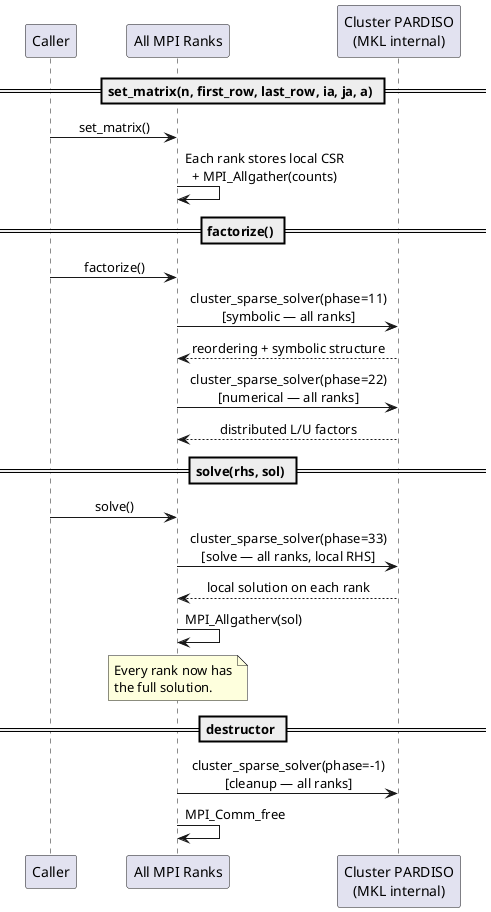
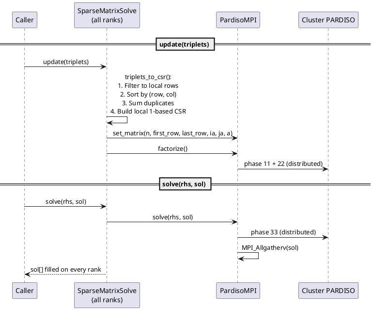

# Developer Guide: How the Solver Works over MPI

This document describes the internal data flow of the two solver classes and
how work is distributed across MPI ranks.

## Architecture Overview

There are two layers:

```
SparseMatrixSolvePardiso          (high-level: triplets in, global solution out)
        |
        v
    PardisoMPI                    (low-level: 1-based CSR in, global solution out)
        |
        v
    MKL Cluster PARDISO           (MPI-parallel direct solver)
```

**Cluster PARDISO** is a truly distributed solver — factorization and solve
work is split across all MPI ranks internally by MKL.  The wrapper classes
handle format conversion and provide a convenient C++ interface.

## Input Model

Both `PardisoMPI` and `SparseMatrixSolvePardiso` use **distributed assembled
input** (`iparm[39] = 2`):

- Every rank calls each method (all operations are **collective**).
- Each rank provides only the matrix rows it owns via `set_matrix()`.
  Row ownership is specified by `first_row` / `last_row` (1-based).
- `iparm[40]` and `iparm[41]` tell Cluster PARDISO each rank's row range.
- Every rank must supply the full global RHS to `solve()`.
- After a solve, the solution is assembled on every rank via
  `MPI_Allgatherv`.

## Data Flow: `PardisoMPI`

### `set_matrix(n, first_row, last_row, ia, ja, a)`

Collective.  Each rank stores its local rows in 1-based CSR.

```
Each rank stores:
  local_ia_ = ia  (size: local_nrows + 1, 1-based)
  local_ja_ = ja  (global 1-based column indices)
  local_a_  = a   (values for local rows)
```

One `MPI_Allgather` exchanges the local row counts to precompute
gather metadata used by `solve()`.

### `factorize()`  — Cluster PARDISO phases 11 + 22

Collective.  All ranks participate in the distributed factorization.

```
All ranks call:
    cluster_sparse_solver(phase=11)   — symbolic factorization
    cluster_sparse_solver(phase=22)   — numerical factorization

Each rank passes its local_ia_, local_ja_, local_a_.
iparm[39]=2, iparm[40]=first_row, iparm[41]=last_row.
```

Internally, Cluster PARDISO distributes the work (reordering, LU factors)
across all ranks using MPI.

### `solve(rhs, sol)`  — Cluster PARDISO phase 33 + broadcast

Collective.  All ranks participate in the distributed solve.

```
Each rank extracts its local portion of the RHS and calls:
    cluster_sparse_solver(phase=33)   — forward/backward substitution

Each rank receives its local portion of the solution.

Then:
    MPI_Allgatherv(local_sol -> sol)

Every rank now has the full solution.
```

### `pardiso_cleanup()`  — phase -1

Collective.  All ranks call `cluster_sparse_solver(phase=-1)` to release
internal memory.  This is called automatically in the destructor.

## Data Flow: `SparseMatrixSolvePardiso`

This is a higher-level wrapper that sits on top of `PardisoMPI`.  It accepts
COO triplets instead of pre-built CSR.

Every rank must supply the **same** complete set of triplets and the **same**
global RHS vector.

### `update(triplets)`

```
1. triplets_to_csr(triplets):
     - Sort all triplets by (row, col)
     - Merge duplicates: entries with same (row,col) have values summed
     - Build 1-based CSR arrays ia_, ja_, a_
2. pardiso_.set_matrix(n, ia, ja, a)   — rank 0 stores full CSR
3. pardiso_.factorize()                — distributed factorization
```

### `solve(rhs, sol)`

```
1. pardiso_.solve(rhs, sol)
     - Cluster PARDISO phase 33 (distributed solve)
     - MPI_Bcast sends the full solution to all ranks
```

## Communication Summary

| Operation          | MPI Calls                                         | Direction     |
|--------------------|---------------------------------------------------|---------------|
| `set_matrix`       | `MPI_Allgather` (gather metadata for solve)       | all → all     |
| `factorize`        | Internal to Cluster PARDISO (phases 11 + 22)      | all ↔ all     |
| `solve`            | Internal to Cluster PARDISO (phase 33) + `MPI_Allgatherv` | all ↔ all  |
| `pardiso_cleanup`  | Internal to Cluster PARDISO (phase -1)            | all ↔ all     |

All operations are **collective** — every rank in the communicator must
participate.  The internal MPI communication is managed entirely by
Cluster PARDISO; the explicit MPI calls in the wrapper are
`MPI_Allgather` in `set_matrix` (to exchange row counts) and
`MPI_Allgatherv` after the solve (to assemble the full solution).

## Sequence Diagram (PlantUML)

### `PardisoMPI`: Full Lifecycle



### `SparseMatrixSolvePardiso`: Update and Solve



## Key Parameters

| iparm index | Value | Meaning |
|-------------|-------|---------|
| `iparm[0]`  | 1     | Use custom parameter values |
| `iparm[1]`  | 2     | Nested dissection reordering (METIS) |
| `iparm[34]` | 0     | 1-based indexing |
| `iparm[39]` | 2     | Distributed assembled matrix input |
| `iparm[40]` | varies | First row owned by this rank (1-based) |
| `iparm[41]` | varies | Last row owned by this rank (1-based) |

## Linking

Cluster PARDISO requires BLACS in addition to the standard MKL libraries:

- **`mkl_rt` (single dynamic library)**: Includes Cluster PARDISO and BLACS
  automatically.  This is the preferred link model.
- **Static/layered linking**: Requires explicit BLACS library:
  - Intel MPI: `-lmkl_blacs_intelmpi_lp64`
  - OpenMPI: `-lmkl_blacs_openmpi_lp64`

The CMakeLists.txt handles both cases.

## Limitations and Design Choices

- **Distributed input**: Each rank provides only its block of rows
  (`iparm[39] = 2`).  This is memory-efficient for large matrices since
  no single rank needs to store the full CSR.  Row partitioning is the
  caller's responsibility for `PardisoMPI`; `SparseMatrixSolvePardiso`
  handles it automatically with a simple block distribution.

- **Allgather after solve**: With distributed input, each rank receives
  only its local portion of the solution from Cluster PARDISO.  The
  wrapper uses `MPI_Allgatherv` so that every rank has the full result,
  matching the caller's expectation.

- **1-based indexing**: PARDISO requires 1-based CSR.  All internal storage
  uses 1-based indexing.  `SparseMatrixSolvePardiso` accepts 0-based triplets
  and converts internally.
