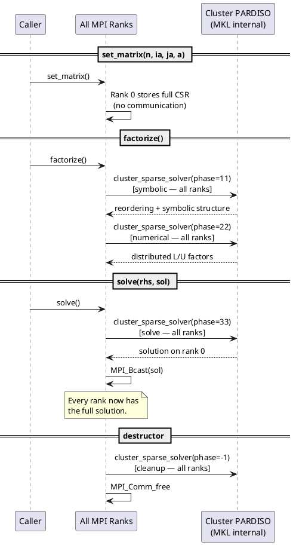
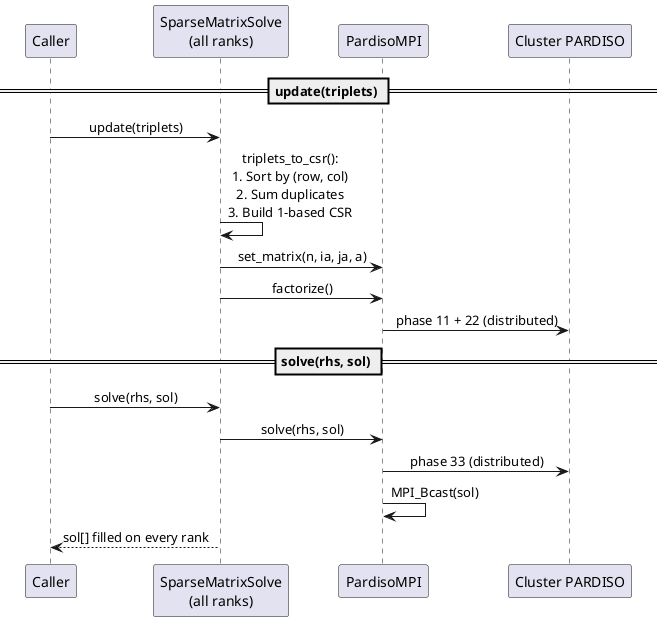

# Developer Guide: How the Solver Works over MPI

This document describes the internal data flow of the two solver classes and
how work is distributed across MPI ranks.

## Architecture Overview

There are two layers:

```
SparseMatrixSolvePardiso          (high-level: triplets in, global solution out)
        |
        v
    PardisoMPI                    (low-level: 1-based CSR in, global solution out)
        |
        v
    MKL Cluster PARDISO           (MPI-parallel direct solver)
```

**Cluster PARDISO** is a truly distributed solver — factorization and solve
work is split across all MPI ranks internally by MKL.  The wrapper classes
handle format conversion and provide a convenient C++ interface.

## Input Model

Both `PardisoMPI` and `SparseMatrixSolvePardiso` use **centralised input**
(`iparm[39] = 0`):

- Every rank calls each method (all operations are **collective**).
- Only rank 0's matrix and RHS data is read by Cluster PARDISO.
- In practice, every rank builds the same full matrix and RHS, so the
  same pointers can be passed on all ranks.
- After a solve, the solution is broadcast to all ranks via `MPI_Bcast`.

## Data Flow: `PardisoMPI`

### `set_matrix(n, ia, ja, a)`

Collective.  Stores the full 1-based CSR matrix on rank 0.

```
rank 0: global_ia_ = ia, global_ja_ = ja, global_a_ = a
other ranks: no data stored
```

No MPI communication occurs.

### `factorize()`  — Cluster PARDISO phases 11 + 22

Collective.  All ranks participate in the distributed factorization.

```
All ranks call:
    cluster_sparse_solver(phase=11)   — symbolic factorization
    cluster_sparse_solver(phase=22)   — numerical factorization

Rank 0 passes global_ia_, global_ja_, global_a_.
Other ranks pass dummy pointers.
```

Internally, Cluster PARDISO distributes the work (reordering, LU factors)
across all ranks using MPI.

### `solve(rhs, sol)`  — Cluster PARDISO phase 33 + broadcast

Collective.  All ranks participate in the distributed solve.

```
All ranks call:
    cluster_sparse_solver(phase=33)   — forward/backward substitution

Rank 0 passes the global RHS and receives the global solution.
Other ranks pass dummy pointers.

Then:
    MPI_Bcast(sol, n, MPI_DOUBLE, 0, comm)

Every rank now has the full solution.
```

### `pardiso_cleanup()`  — phase -1

Collective.  All ranks call `cluster_sparse_solver(phase=-1)` to release
internal memory.  This is called automatically in the destructor.

## Data Flow: `SparseMatrixSolvePardiso`

This is a higher-level wrapper that sits on top of `PardisoMPI`.  It accepts
COO triplets instead of pre-built CSR.

Every rank must supply the **same** complete set of triplets and the **same**
global RHS vector.

### `update(triplets)`

```
1. triplets_to_csr(triplets):
     - Sort all triplets by (row, col)
     - Merge duplicates: entries with same (row,col) have values summed
     - Build 1-based CSR arrays ia_, ja_, a_
2. pardiso_.set_matrix(n, ia, ja, a)   — rank 0 stores full CSR
3. pardiso_.factorize()                — distributed factorization
```

### `solve(rhs, sol)`

```
1. pardiso_.solve(rhs, sol)
     - Cluster PARDISO phase 33 (distributed solve)
     - MPI_Bcast sends the full solution to all ranks
```

## Communication Summary

| Operation          | MPI Calls                                         | Direction     |
|--------------------|---------------------------------------------------|---------------|
| `set_matrix`       | None                                              | —             |
| `factorize`        | Internal to Cluster PARDISO (phases 11 + 22)      | all ↔ all     |
| `solve`            | Internal to Cluster PARDISO (phase 33) + `MPI_Bcast` | all ↔ all  |
| `pardiso_cleanup`  | Internal to Cluster PARDISO (phase -1)            | all ↔ all     |

All operations are **collective** — every rank in the communicator must
participate.  The internal MPI communication is managed entirely by
Cluster PARDISO; the only explicit MPI call in the wrapper is the
`MPI_Bcast` after the solve to ensure every rank has the full solution.

## Sequence Diagram (PlantUML)

### `PardisoMPI`: Full Lifecycle



### `SparseMatrixSolvePardiso`: Update and Solve



## Key Parameters

| iparm index | Value | Meaning |
|-------------|-------|---------|
| `iparm[0]`  | 1     | Use custom parameter values |
| `iparm[1]`  | 2     | Nested dissection reordering (METIS) |
| `iparm[34]` | 0     | 1-based indexing |
| `iparm[39]` | 0     | Centralised matrix input (rank 0 only) |

## Linking

Cluster PARDISO requires BLACS in addition to the standard MKL libraries:

- **`mkl_rt` (single dynamic library)**: Includes Cluster PARDISO and BLACS
  automatically.  This is the preferred link model.
- **Static/layered linking**: Requires explicit BLACS library:
  - Intel MPI: `-lmkl_blacs_intelmpi_lp64`
  - OpenMPI: `-lmkl_blacs_openmpi_lp64`

The CMakeLists.txt handles both cases.

## Limitations and Design Choices

- **Centralised input**: Every rank builds the full matrix and RHS.
  For very large matrices this may be memory-inefficient; Cluster PARDISO
  also supports distributed input (`iparm[39] = 1`) where each rank
  provides only its block of rows, but this wrapper does not currently
  expose that mode.

- **Broadcast after solve**: With `iparm[39] = 0`, only rank 0 receives
  the solution from Cluster PARDISO.  The wrapper broadcasts it so that
  every rank has the full result, matching the caller's expectation.

- **1-based indexing**: PARDISO requires 1-based CSR.  All internal storage
  uses 1-based indexing.  `SparseMatrixSolvePardiso` accepts 0-based triplets
  and converts internally.
